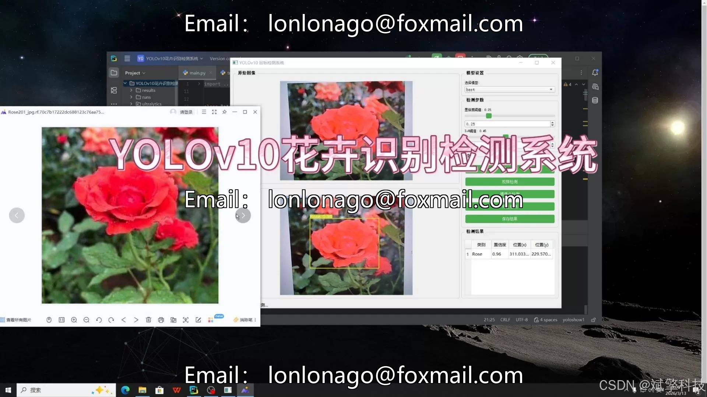
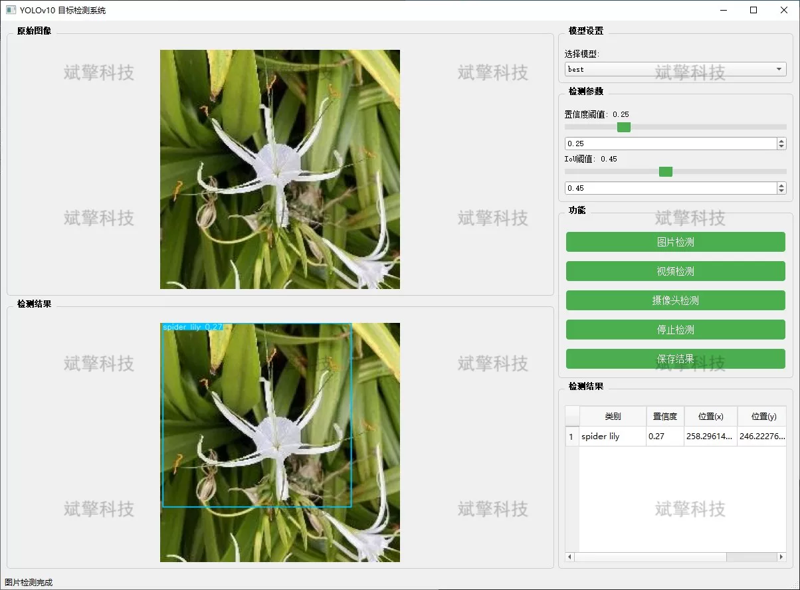
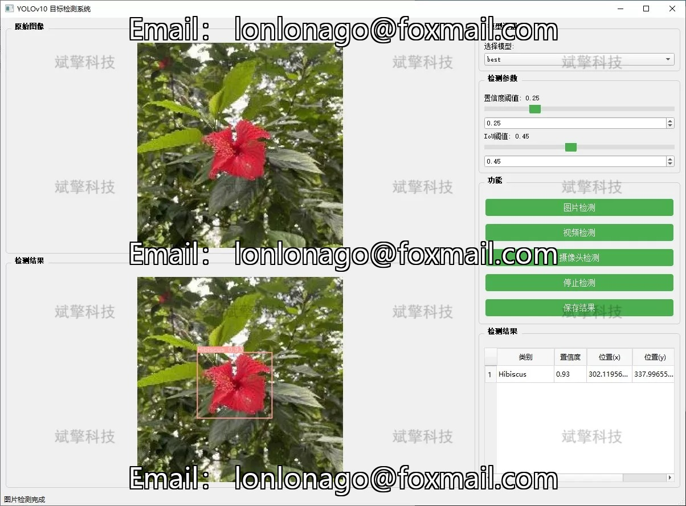
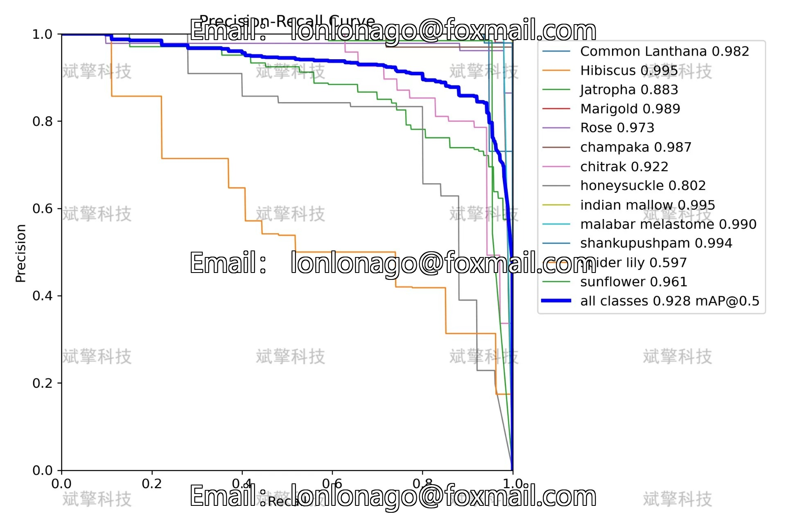

# YOLOv10 Flower Recognition System

## Body

YOLOv10 Flower Identification System Based on YOLOv10 Deep Learning for Flower Recognition and Detection (YOLOv10+YOLO dataset + UI interface + Python project + model)

This project has developed a flower recognition and detection system based on the YOLOv10 deep learning model, aiming to achieve automated and intelligent recognition and localization of various flowers. The system covers a complete detection process, supporting static image detection, offline video detection, and real-time camera detection in three modes, meeting the application needs in different scenarios.

In terms of technical implementation, the project uses YOLOv10 as the core detection network. This model further optimizes the network structure and loss function on the basis of the YOLO series, significantly improving inference speed while ensuring high detection accuracy. It is suitable for deployment in applications with higher real-time requirements. Through specialized training on 13 types of flower categories, the model can effectively handle complex backgrounds, scale changes, and partial occlusions, demonstrating strong generalization capabilities.

System Features

✅ Image Detection: Can detect images and return detection boxes and category information.

✅ Video Detection: Supports input of video files, detecting the situation in each frame of the video.

✅ Real-Time Camera Detection: Connects USB cameras to achieve real-time monitoring.

✅ Parameter Real-Time Adjustment (Confidence and IoU Thresholds)

Dataset Introduction

Training set: 1891 images, used for model training and parameter optimization
Validation set: 529 images, used for model tuning and performance validation
Test set: 326 images, used for final model performance evaluation

## Images

## Payment

Here is a pay link on Stripe ( https://buy.stripe.com/3cs8yP7sY87d0vu9AB ). Please contact me lonlonago@foxmail.com after funding $89, and I will send you a complete data files , thank you!

